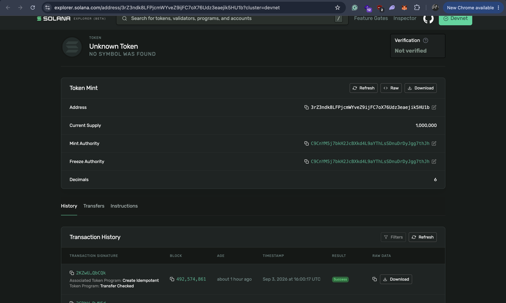
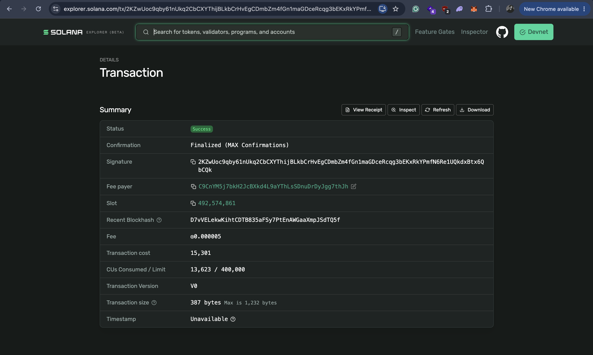
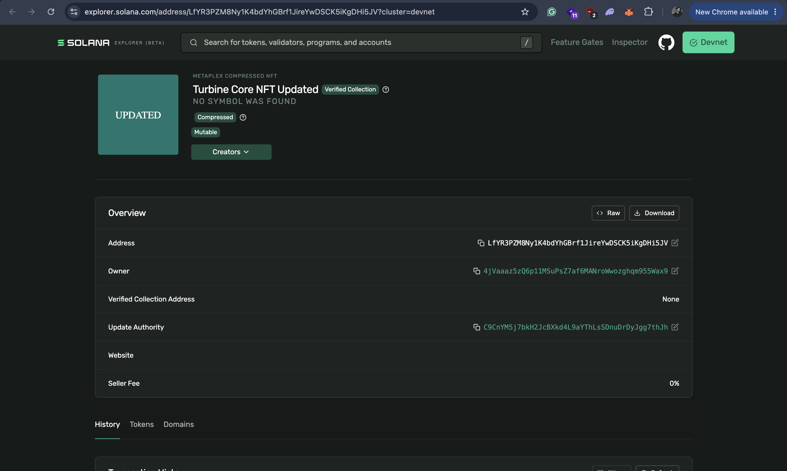
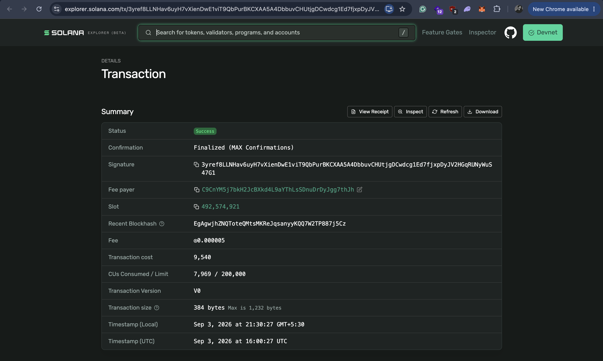

# SPL Token + MPL Core Assignment

TypeScript implementation of the complete SPL Token and MPL Core lifecycle on Solana devnet.

## Features

- SPL Mint
- SPL Transfer
- NFT Mint (MPL Core)
- NFT Metadata Update
- NFT Transfer
- NFT Burn

## Setup

Requirements: Node.js 20.18+, npm, Solana CLI, and a funded devnet wallet.

```bash
npm ci
cp .env.example .env
solana config set --url devnet
solana airdrop 2 "$(solana address)" --url devnet
npm run preflight:devnet
```

`WALLET_PATH` is optional and falls back to `~/.config/solana/id.json`. Use a dedicated devnet RPC in `.env` if the public endpoint is rate-limited.

## Run

```bash
npm run build
npm test
npm run test:devnet
```

`npm test` runs offline tests and skips the devnet suite. `test:devnet` performs the complete lifecycle, including an expected unauthorized update rejection and the irreversible burn.

Individual commands are also available:

```bash
npm run spl:init && npm run spl:mint && npm run spl:transfer
npm run nft:image && npm run nft:metadata && npm run nft:mint
npm run nft:update && npm run nft:transfer && npm run nft:burn
```

The lifecycle uses these public metadata documents after this branch is pushed to `main`:

- [Initial metadata](https://raw.githubusercontent.com/aashwani106/spl-nft-q326/main/tests/fixtures/core-metadata.json)
- [Updated metadata](https://raw.githubusercontent.com/aashwani106/spl-nft-q326/main/tests/fixtures/core-metadata-updated.json)

Both fixtures contain validated `name`, `description`, and self-contained SVG image data.

## Devnet Evidence

| Action | Address / Signature |
| --- | --- |
| SPL Mint Address | [3rZ3ndk8LFPjcmWYveZ9ijFC7oX76Udz3eaejik5HU1b](https://explorer.solana.com/address/3rZ3ndk8LFPjcmWYveZ9ijFC7oX76Udz3eaejik5HU1b?cluster=devnet) |
| SPL Mint Tx | [PArgxi…rn7Y](https://explorer.solana.com/tx/PArgxiUhaUAHCxdkmD2dfbh2W4XrtKQyNdHMKGyTxDEFSVru7v96y216BfdfTDCA3w8eLH7xeh7T6jvQ5bErn7Y?cluster=devnet) |
| SPL Supply Tx | [2GDbW…wN6d](https://explorer.solana.com/tx/2GDbWqGvQBgQkruGW253M5yiDgCWLK9zDksXfsCrAmBtz7aouSavyQbyLgm83canwtTH7EHJa8sLQL89CUpDwN6d?cluster=devnet) |
| SPL Transfer Tx | [2KZwU…bCQk](https://explorer.solana.com/tx/2KZwUoc9qby61nUkq2CbCXYThijBLkbCrHvEgCDmbZm4fGn1maGDceRcqg3bEKxRkYPmfN6Re1UQkdxBtx6QbCQk?cluster=devnet) |
| NFT Asset | [LfYR3PZM8Ny1K4bdYhGBrf1JireYwDSCK5iKgDHi5JV](https://explorer.solana.com/address/LfYR3PZM8Ny1K4bdYhGBrf1JireYwDSCK5iKgDHi5JV?cluster=devnet) |
| NFT Create Tx | [4MRT2…wPNk](https://explorer.solana.com/tx/4MRT2emhP2AKukfsDV7gZpw5CbmJ9E8cHuPpCYvC1fmRA64n3GeYtonXabWhe63xdptnwHhxcdir2DfB9ikQwPNk?cluster=devnet) |
| NFT Update Tx | [3yref…47G1](https://explorer.solana.com/tx/3yref8LLNHav6uyH7vXienDwE1viT9QbPurBKCXAA5A4DbbuvCHUtjgDCwdcg1Ed7fjxpDyJV2HGqRUNyWuS47G1?cluster=devnet) |
| NFT Transfer Tx | [4AajQ…V5MFf](https://explorer.solana.com/tx/4AajQCeYHYcNEf6CBw6rsx8wPTfhNaSWi25vrzZvKgnLzSGkZomkzGp5v1ZuSE9VgKGUXJ6ZgUwxCMNxci7V5MFf?cluster=devnet) |
| NFT Burn Tx | [3h4Mz…11uzu](https://explorer.solana.com/tx/3h4Mz2DyMCTwBjQbGNECzUHhpEpEEmcsk5vSHUZWPyXgVNq3aEBSjuW5qKieTybS6L2rwJYdVrJbhdNNdvg11uzu?cluster=devnet) |

The unauthorized update was rejected during simulation with MPL Core `NoApprovalsError`; no invalid transaction was submitted. The burn finalized and left the expected non-deserializable Core tombstone.

## Screenshots

Required:

1. SPL Mint

   

2. SPL Transfer

   

3. NFT Create

   

4. NFT Update

   

5. NFT Transfer

   

6. NFT Burn

   
